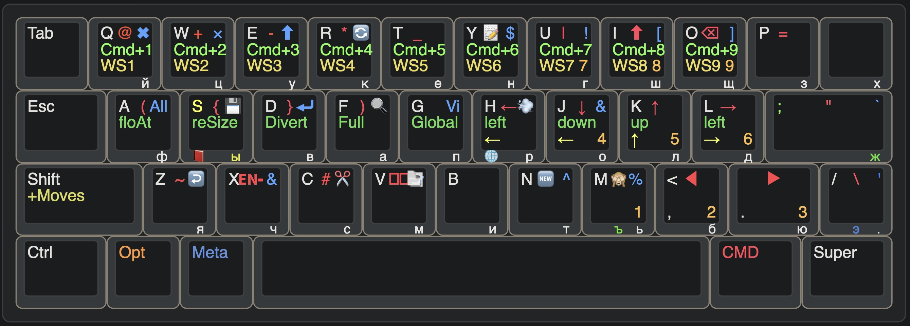

## Dotfiles

- Neovim
- Vim
- IdeaVim
- Sioyek (PDF reader)
- Karabiner (key remap)
- Aerospace (vm)

### Installation

```bash
## needs an update and some manual work
cd dotfiles
bash first_init.sh ~/dotfiles
```
### Keyboard visualization 


