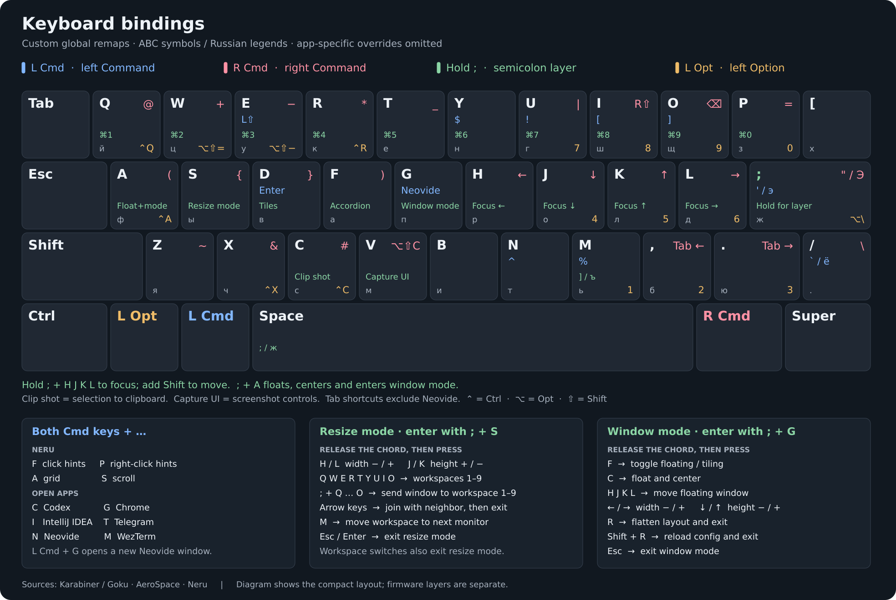

## Dotfiles

- Neovim
- Vim
- IdeaVim
- Sioyek (PDF reader)
- Karabiner (key remap)
- Aerospace (vm)
- Neru (keyboard-driven mouse control)
- Neovide as the default app for text and source files

### Installation

```bash
cd dotfiles
./first_init.sh
```

The script uses its own directory as the repository path and creates config symlinks in your home directory. Run it as your normal user; open a new terminal when setup finishes.

### Default text app

```bash
bash scripts/set-default-text-app.sh
```

### Deinit

```bash
cd dotfiles
bash deinit.sh
```

### Keyboard visualization

[](resources/keyboard_data/keyboard-layout.svg)

Based on [Karabiner / Goku](.config/karabiner.edn), [AeroSpace](.config/aerospace/aerospace.toml), and [Neru](.config/neru/config.toml). Click the image to zoom.

To update the key labels, edit the [KLE layout](resources/keyboard_data/keyboard-layout.json); the mode notes live in the renderer. Regenerate the SVG with:

```bash
python3 resources/keyboard_data/render-layout.py
```
