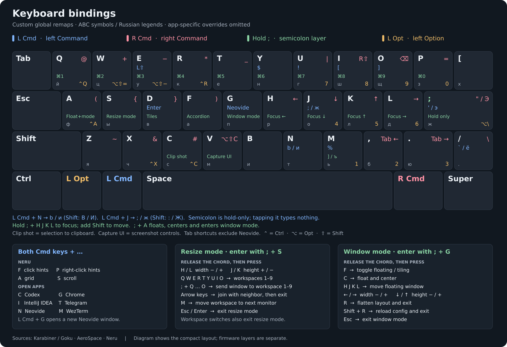

## Dotfiles

- Neovim
- Vim
- IdeaVim
- Sioyek (PDF reader)
- Karabiner (key remap)
- Aerospace (vm)
- Neru (keyboard-driven mouse control)
- Neovide as the default app for text and source files

### Installation

```bash
cd dotfiles
./first_init.sh
```

The script uses its own directory as the repository path and creates config symlinks in your home directory. Run it as your normal user; open a new terminal when setup finishes.

### Default text app

```bash
bash scripts/set-default-text-app.sh
```

### Deinit

```bash
cd dotfiles
bash deinit.sh
```

### Hotkey usage statistics

```bash
python3 scripts/karabiner-stats.py install
python3 scripts/karabiner-stats.py report --days 14 --all
```

New shells also have `keystats`, `keystats --all`, and `keystats --days 14 --csv`.
The login service counts Karabiner complex-rule activations and stores daily totals
in `~/.local/share/karabiner-stats/counts.sqlite3`. It stores no text or event history.
Holding a key counts once, without inflating counts from auto-repeat. Rules inside
Vim or AeroSpace modes are outside its scope. Zero means unused since installation.

Keep editing `.config/karabiner.edn` and running `goku` normally: the receiver
reattaches counting hooks within two seconds. Existing outputs and their order stay
unchanged. Changing a rule's action or conditions starts a new counter; older data
stays in the database. Requires Karabiner's `send_user_command` support (tested on 16.3).

To stop collecting and remove the hooks, run
`python3 scripts/karabiner-stats.py uninstall`. Statistics are preserved. Service
errors are in `~/.local/share/karabiner-stats/receiver.log`.

### Keyboard visualization

[](resources/keyboard_data/keyboard-layout.svg)

Based on [Karabiner / Goku](.config/karabiner.edn), [AeroSpace](.config/aerospace/aerospace.toml), and [Neru](.config/neru/config.toml). Click the image to zoom, or use the [JPG version](resources/keyboard_data/keyboard-layout.jpg).

To update the key labels, edit the [KLE layout](resources/keyboard_data/keyboard-layout.json); the mode notes live in the renderer. Regenerate the SVG with:

```bash
python3 resources/keyboard_data/render-layout.py
```

Refresh the JPG from the same SVG with `rsvg-convert` (Homebrew `librsvg`) and macOS `sips`:

```bash
rsvg-convert --background-color '#111820' --output /tmp/dotfiles-keyboard-layout.png resources/keyboard_data/keyboard-layout.svg
sips -s format jpeg -s formatOptions 95 /tmp/dotfiles-keyboard-layout.png --out resources/keyboard_data/keyboard-layout.jpg
```
